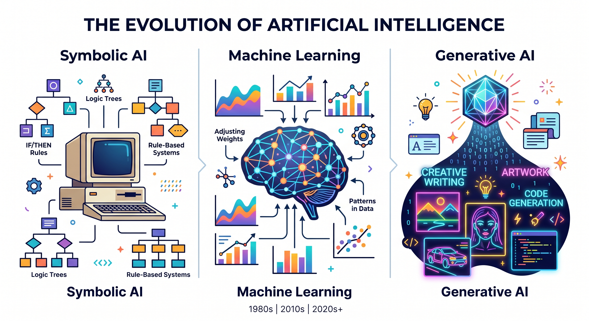

<head>
  <link rel="stylesheet" href="../styles/custom.css">
  <script src="../scripts/app.js" defer></script>
  <script src="https://polyfill.io/v3/polyfill.min.js?features=es6"></script>
  <script id="MathJax-script" async src="https://cdn.jsdelivr.net/npm/mathjax@3/es5/tex-mml-chtml.js"></script>
  <script src="https://cdn.jsdelivr.net/npm/mermaid@10/dist/mermaid.min.js"></script>
  <script>
    document.addEventListener('DOMContentLoaded', function() {
      mermaid.initialize({ startOnLoad: true, theme: 'default' });
    });
  </script>
</head>

<a href="../index.html" class="btn-back">← Повернутися на головну</a>

<div class="glass-panel" markdown="1">

# 🧠 Теоретичний блок: Як працює генеративний ШІ?

<div class="info-box">
  <h3 style="margin-top: 0; color: var(--primary);">Що таке Штучний Інтелект (ШІ)?</h3>
  <p style="margin-bottom: 0;"><b>Штучний інтелект</b> — це здатність комп'ютерних систем виконувати завдання, які зазвичай потребують людського розуму (розпізнавання мови, прийняття рішень, візуальне сприйняття).</p>
</div>

### 📈 Еволюція ШІ:
1. ⚙️ **Правиловий ШІ (Символьний):** Працює за жорстко заданими правилами *"Якщо -> Тоді"*.
2. 📊 **Машинне навчання (ML):** Система сама знаходить закономірності у великих масивах даних.
3. 🎨 **Генеративний ШІ (GenAI):** Здатний створювати новий, унікальний контент (текст, зображення, код, музику) на основі вивчених шаблонів.

<div align="center" style="margin: 30px 0;">
  
</div>

---

## 📚 Великі мовні моделі (LLM)
Такі системи, як ChatGPT, Gemini або Claude, базуються на LLM (Large Language Models). Їхній головний принцип роботи — **передбачення наступного слова (токена)**. Вони не "думають" як люди, а використовують складну математику та статистику, щоб визначити, яке слово з найбільшою ймовірністю має йти далі у реченні.

<div class="alert-box">
  <div style="display: flex; align-items: center; margin-bottom: 10px;">
    <span style="font-size: 24px; margin-right: 15px;">⚠️</span>
    <h4 style="margin: 0;">Важливо: Галюцинації ШІ</h4>
  </div>
  <p style="margin-bottom: 0;">Оскільки ШІ лише математично вгадує слова, він іноді може впевнено видавати абсолютно неправдиву інформацію. Це небезпечне явище називається <b>галюцинацією ШІ</b> і вимагає обов'язкового фактчекінгу.</p>
</div>

## ✍️ Основи промпт-інжинірингу
**Промпт** (запит) — це текст, який ви надсилаєте штучному інтелекту, щоб отримати відповідь. 

<div class="info-box" style="text-align: center;">
  <span style="font-family: monospace; font-size: 1.2em; color: var(--primary);">Формула ідеального промпту: <br><b>[РОЛЬ] + [КОНТЕКСТ] + [ЗАВДАННЯ] + [ФОРМАТ]</b></span>
</div>

* ❌ **Поганий промпт:** *"Напиши про космос."*
* ✅ **Хороший промпт:** *"Дій як вчитель астрономії (Роль). Учням 10 класу складно зрозуміти чорні діри (Контекст). Поясни, що таке горизонт подій (Завдання). Використовуй прості аналогії з побуту та маркований список (Формат)."*

---

## 📐 Математична модель та логіка

В основі роботи мовних моделей лежить функція **Softmax**, яка розраховує ймовірність наступного токена. Формула виглядає так:

$$\sigma(\mathbf{z})_j = \frac{e^{z_j}}{\sum_{k=1}^K e^{z_k}}$$

### 🤖 Алгоритм генерації (Блок-схема)
```mermaid
graph LR
    A[Промпт користувача] --> B{Токенізація}
    B --> C[Передбачення токена]
    C --> D[Декодування тексту]
    D --> E[Фінальна відповідь]
    style C fill:#f9f,stroke:#333,stroke-width:4px
