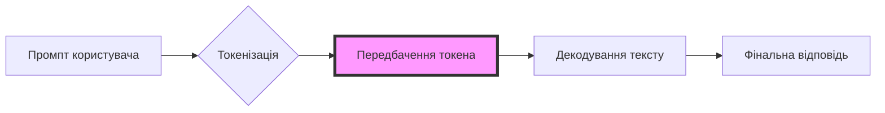
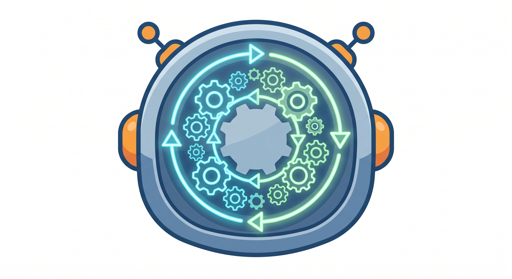

<head>
  <link rel="stylesheet" href="../styles/custom.css">
  
  
  
  
  
</head>

<a href="../index.html" class="btn-back">← Повернутися на головну</a>

# 🧠 Теоретичний блок: Як працює генеративний ШІ?

  <h3 class="text-adaptive" style="margin-top: 0;">Що таке Штучний Інтелект (ШІ)?</h3>
  
<b>Штучний інтелект</b> — це здатність комп'ютерних систем виконувати завдання, які зазвичай потребують людського розуму (розпізнавання мови, прийняття рішень, візуальне сприйняття).

### 📈 Еволюція ШІ:
1. ⚙️ **Правиловий ШІ (Символьний):** Працює за жорстко заданими правилами *"Якщо -> Тоді"*.
2. 📊 **Машинне навчання (ML):** Система сама знаходить закономірності у великих масивах даних.
3. 🎨 **Генеративний ШІ (GenAI):** Здатний створювати новий, унікальний контент (текст, зображення, код, музику) на основі вивчених шаблонів.

  

---

## 📚 Великі мовні моделі (LLM)
Такі системи, як ChatGPT, Gemini або Claude, базуються на LLM (Large Language Models). Їхній головний принцип роботи — **передбачення наступного слова (токена)**. Вони не "думають" як люди, а використовують складну математику та статистику, щоб визначити, яке слово з найбільшою ймовірністю має йти далі у реченні.

  

    ⚠️
    <h4 style="margin: 0;">Важливо: Галюцинації ШІ</h4>
  

  
Оскільки ШІ лише математично вгадує слова, він іноді може впевнено видавати абсолютно неправдиву інформацію. Це небезпечне явище називається <b>галюцинацією ШІ</b> і вимагає обов'язкового фактчекінгу.

  

---

## ⚖️ Етика ШІ та Сучасні Виклики
Розвиток технологій несе не лише нові можливості, але й загрози. Сучасне суспільство стикається з трьома головними етичними проблемами:

1. 🎭 **Дипфейки (Deepfakes):** ШІ здатний генерувати реалістичні відео та аудіо з обличчям та голосом реальних людей, що може бути використано для шахрайства або політичних маніпуляцій.
2. © **Авторське право:** Моделі навчаються на мільйонах зображень та текстів реальних авторів без їхнього дозволу. Чи належить згенерована картина користувачеві, програмістам, чи оригінальним художникам? Це питання досі вирішується в судах.
3. 📉 **Упередженість алгоритмів (Bias):** Якщо алгоритм навчали на даних, що містять расові або гендерні стереотипи, модель буде відтворювати та посилювати цю упередженість у своїх відповідях.

---

## 🚧 Технічні Обмеження LLM
Не варто переоцінювати можливості ШІ. Нейромережі мають кілька суттєвих "слабких місць":
* 🪟 **Контекстне вікно (Context Window):** Модель пам'ятає лише обмежену кількість слів в одному діалозі. Якщо ви перевищите цей ліміт (наприклад, завантаживши книгу цілком), ШІ просто "забуде" початок вашої розмови.
* 🧠 **Відсутність розуміння:** LLM не розуміє сенсу слів. Вона не знає, що таке "яблуко", вона лише знає, що слова "смачне", "червоне" та "фрукт" статистично часто стоять поруч.
* 🕒 **Заморожені знання:** Моделі не навчаються в реальному часі. Знання ChatGPT закінчуються датою його останнього тренування (якщо не використовуються плагіни для пошуку в інтернеті).

---

## 🌡️ Керування генерацією: Температура
Крім самого тексту промпту, розробники можуть впливати на результат через параметр **Temperature** (Температура). Це значення від 0.0 до 2.0:
* **Низька температура (0.0 - 0.3):** Модель обирає найбільш ймовірні слова. Відповідь стає дуже логічною, передбачуваною та сухою. Ідеально для програмування або аналізу даних.
* **Висока температура (0.7 - 1.0+):** Модель починає обирати менш ймовірні слова. Відповідь стає креативною, нестандартною, але зростає ризик галюцинацій та безглуздого тексту. Ідеально для написання віршів чи мозкового штурму.

---

## ✍️ Основи промпт-інжинірингу
**Промпт** (запит) — це текст, який ви надсилаєте штучному інтелекту, щоб отримати відповідь. 

  Формула ідеального промпту:  <b>[РОЛЬ] + [КОНТЕКСТ] + [ЗАВДАННЯ] + [ФОРМАТ]</b>

  

* ❌ **Поганий промпт:** *"Напиши про космос."*
* ✅ **Хороший промпт:** *"Дій як вчитель астрономії (Роль). Учням 10 класу складно зрозуміти чорні діри (Контекст). Поясни, що таке горизонт подій (Завдання). Використовуй прості аналогії з побуту та маркований список (Формат)."*

---

## 🏗️ Просунуті фреймворки промптингу
Для вирішення складних бізнес-задач або програмування базової формули недостатньо. Професійні промпт-інжиніри використовують спеціальні фреймворки (структуровані шаблони).

### 1. Фреймворк RACE
Використовується для аналітичних завдань та відповідей на складні питання.
* **R (Role) — Роль:** *"Ти — Senior Data Analyst."*
* **A (Action) — Дія:** *"Проаналізуй наведені дані про продажі."*
* **C (Context) — Контекст:** *"Ми готуємо квартальний звіт для інвесторів."*
* **E (Expectation) — Очікування:** *"Надай лише 3 ключові інсайти у форматі маркованого списку."*

### 2. Фреймворк APE
Ідеально підходить для маркетингу та копірайтингу.
* **A (Action) — Дія:** *"Напиши рекламний пост."*
* **P (Purpose) — Мета:** *"Щоб залучити нових підписників на безкоштовний вебінар з ІТ."*
* **E (Expectation) — Очікування:** *"Текст має бути емоційним, містити заклик до дії (CTA) та максимум 50 слів."*

### 3. Фреймворк CREATE
Використовується для генерації креативного або нестандартного контенту (сценарії, концепції).
* **C (Character) — Персонаж:** хто говорить.
* **R (Request) — Запит:** що саме потрібно створити.
* **E (Examples) — Приклади:** надання ШІ зразків хорошої відповіді (Few-shot prompting).
* **A (Adjustment) — Налаштування:** "Уникай кліше", "Не використовуй пасивний стан".
* **T (Type) — Тип:** формат виводу (таблиця, есе, код).
* **E (Extras) — Додатково:** будь-які інші деталі (наприклад, включення певних ключових слів).

---

## 📐 Математична модель та логіка

В основі роботи мовних моделей лежить функція **Softmax**, яка розраховує ймовірність наступного токена. Формула виглядає так:

$$\sigma(\mathbf{z})_j = \frac{e^{z_j}}{\sum_{k=1}^K e^{z_k}}$$

### 🤖 Алгоритм генерації (Блок-схема)

  

<!-- Виходимо з markdown-контейнера для чистого HTML -->

  <h3 class="text-adaptive" style="margin-top: 0; margin-bottom: 25px; font-size: 1.8rem;">🎬 Демонстрація роботи ШІ</h3>
  

    <video controls style="position: absolute; top: 0; left: 0; width: 100%; height: 100%; background: #000; border-radius: 20px;">
      <source src="../resources/videos/ai_demo.mp4" type="video/mp4">
      Ваш браузер не підтримує відео.
    </video>
  

